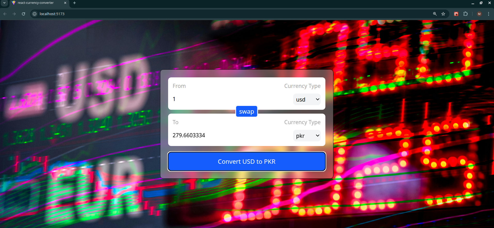

# React Currency Converter 💱

A real-time currency conversion application built with React and Tailwind CSS. This project focuses on creating **Custom Hooks** for API handling, building reusable UI components, and managing data flow between parent and child components.

## 🚀 Features

- **Real-Time Exchange Rates:** Fetches live currency data from an external API.
- **Custom Hook Integration:** logic abstracted into a clean `useCurrencyInfo` hook.
- **Two-Way Conversion:** "Swap" feature to instantly reverse the conversion direction.
- **Reusable Components:** Modular `InputBox` component designed for scalability.
- **Dynamic Dropdowns:** Automatically populates currency options based on API response.

## 🛠️ Tech Stack

- **Library:** React JS
- **Styling:** Tailwind CSS
- **Build Tool:** Vite

## 🧠 Concepts & Hooks Used

This project was built to master Custom Hooks and Component reusability. Here is how the core concepts are applied:

- **`useState`**: Used heavily to manage the application state, including the `amount` to convert, the `from` and `to` currency selections, and the final `convertedAmount`.
- **`useEffect`**: Implemented inside the custom hook to automatically trigger the API call whenever the selected `currency` dependency changes, ensuring data is always in sync.
- **`Custom Hooks` (`useCurrencyInfo`)**: The core feature of this project. The API fetching logic is extracted into a standalone function, demonstrating how to create reusable logic that can be shared across components.
- **Reusable Components & Props**: The UI uses a dedicated `<InputBox />` component. This demonstrates 
- **"Lifting State Up"**—passing methods like `onAmountChange` and `onCurrencyChange` from the parent to the child to control the application state.

## 🖥️ Screenshots

**Currency Converter Interface**


## 💻 How to Run Locally

1. **Clone the repository**
   ```bash
   git clone [https://github.com/umersaif11/react-currency-converter.git](https://github.com//react-currency-converter.git)
   ```

2. Navigate to the project directory
```bash
   cd react-currency-converter
```    
3. Start the development server
```bash
   npm run dev
```  
   